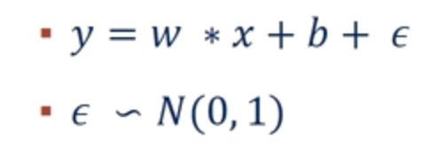
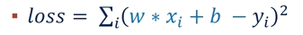
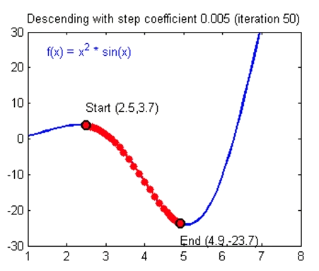
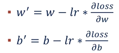
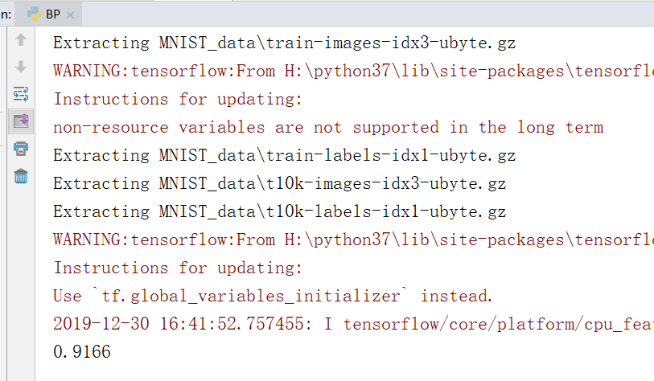

# 1 BP神经网络
- [1.1算法介绍](#11算法介绍)
- [1.2实验代码](#12实验代码)
- [1.3实验结果](#13实验结果)
- [1.4实验总结](#14实验总结)
## 1.1算法介绍

反向传播（英语：Backpropagation，缩写为BP）是“误差反向传播”的简称，是一种与最优化方法（如梯度下降法）结合使用的，用来训练人工神经网络的常见方法。该方法对网络中所有权重计算损失函数的梯度。这个梯度会反馈给最优化方法，用来更新权值以最小化损失函数。反向传播要求有对每个输入值想得到的已知输出，来计算损失函数梯度。因此，它通常被认为是一种监督式学习方法。反向传播要求人工神经元（或“节点”）的激励函数可微。

下面举一个简单的例子来介绍什么是梯度下降法以及如何训练神经网络。

假设有这样一个函数（ε是噪声）



但我们不知道参数的值，也就是w和b的值，但是我们直到很多（x,y）。那么我们可以通过这些值来预测原函数。

构造如下的损失函数



其中的x和y都是真实值，而w和b是我们要预测的值。我们预测的w和b应该使得损失函数越小越好，这点不难看出，损失函数越小证明我们预测出来的函数越接近真实情况。

 

假设我们得到的loss函数图像如上图所示，那么我们得目的就是找到一组w和b使得loss函数值处于一个极小值。



约定w和b按照上面得式子更新自己的值。其中w和b是原来的值，w'和b'是新值，lr是learning rate的缩写，直观理解就是横坐标移动的程度。根据高等数学的相关知识，我们知道函数梯度的方向指向极大值，所以上面式子用减号，也就达到了梯度下降的目的。梯度下降可以使得loss函数处于极小值。当然处于极小值不一定是处于最小值，可能会造成局部最优解，但这些问题超出了本篇实验报告的讨论范围，所以不作考虑。

经过若干次的更新w和b，我们就会找到一个较小的loss值，也就是说我们找到的w和b就很接近真实值了。

梯度下降是一种常用的优化loss函数的方法，还有其他的方法也可以对loss函数进行优化，例如随机梯度下降、Adagrad、Adam等。

下面介绍应用BP算法完成手写体识别问题。MNIST数据集的每一张图片是一个28x28的矩阵，每个元素是其位置的灰度信息。

我们首先将二维的矩阵打平成一维的，也就是说变成一个784x1的矩阵。上面介绍的简单的例子是单个数字，这里成了矩阵，所以我们的参数也应该是矩阵。

假设我们先将784x1的矩阵乘以一个512x784的矩阵参数，将得到一个512x1的矩阵

再将512x1的矩阵乘以一个256x512的矩阵参数，将得到一个256x1的矩阵

再将256x1的矩阵乘以一个10x256的矩阵参数，将得到一个10x1的矩阵

经过上述操作，我们将一个784x1的矩阵转换成了一个10x1的矩阵。为什么最后要转换成10个元素的矩阵？因为我们的手写体识别问题中有10个数字，最后我们得到的矩阵的每个元素代表的是可能是相应数字的概率。根据得到的概率和实际情况来构造损失函数，再利用梯度下降的方法来更新参数。

上述的好几步的矩阵转换操作实际上就是神经网络中的层，最后一步的10个元素属于输出层，第一次的784x1是输入层，中间的则是隐藏层。

## 1.2实验代码

```python
#下载、导入数据用到的函数包
import input_data
#tensorflow 2.x没有placeholder所以要用1.x的API
import tensorflow.compat.v1 as tf
tf.disable_v2_behavior()
#读取数据
mnist = input_data.read_data_sets("MNIST_data", one_hot=True)
#不是一个特定的值，而是一个占位符placeholder
# 我们在TensorFlow运行计算时输入这个值。我们希望能够输入任意数量的MNIST图像，每一张图展平成784维的向量。
x = tf.placeholder("float", [None, 784])
#W的维度是[784，10]，因为我们想要用784维的图片向量乘以它以得到一个10维的证据值向量
W = tf.Variable(tf.zeros([784,10]))
#b的形状是[10]，所以我们可以直接把它加到输出上面
b = tf.Variable(tf.zeros([10]))
#softmax模型
y = tf.nn.softmax(tf.matmul(x,W) + b)
#为了计算交叉熵，我们首先需要添加一个新的占位符用于输入正确值
y_ = tf.placeholder("float", [None,10])
#计算交叉熵
cross_entropy = -tf.reduce_sum(y_*tf.log(y))
#使用反向传播算法(backpropagation algorithm)进行训练
train_step = tf.train.GradientDescentOptimizer(0.01).minimize(cross_entropy)
#初始化tensorflow
init = tf.initialize_all_variables()
sess = tf.Session()
sess.run(init)
#让模型循环训练1000次
for i in range(1000):
    batch_xs, batch_ys = mnist.train.next_batch(100)
    sess.run(train_step, feed_dict={x: batch_xs, y_: batch_ys})
correct_prediction = tf.equal(tf.argmax(y,1), tf.argmax(y_,1))
accuracy = tf.reduce_mean(tf.cast(correct_prediction, "float"))
print(sess.run(accuracy, feed_dict={x: mnist.test.images, y_: mnist.test.labels}))
```

## 1.3实验结果

可以看出经过1000次的训练，模型识别手写体的准确度达到了0.9166



## 1.4实验总结

BP神经网络的原理并不难，可以自行手动实现，但使用TensorFlow不仅方便，而且有更高的效率。

Python的数值计算效率并不高，要实现高效的数值运算一般会使用NumPy这样的库，将运算放到外部其他语言封装好的程序中，以此来完成高效运算。但是从外部计算切换回Python的每一个操作，仍然是一个很大的开销。

TensorFlow也把复杂的计算放在Python之外完成，但是为了避免前面说的那些开销，它做了进一步完善。Tensorflow不单独地运行单一的复杂计算，而是让我们可以先用图描述一系列可交互的计算操作，然后全部一起在Python之外运行。