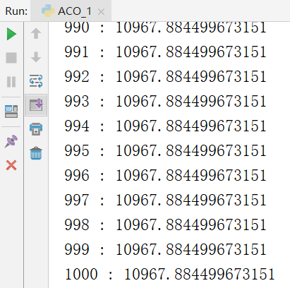
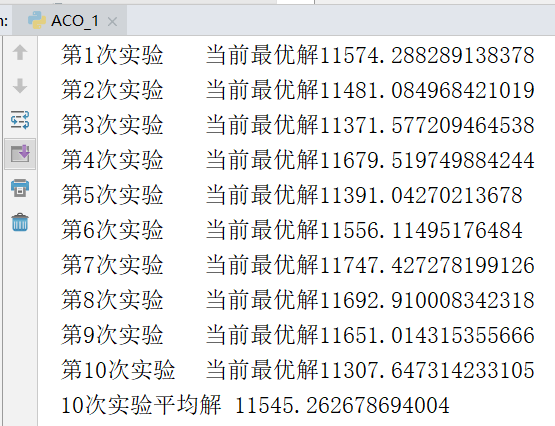
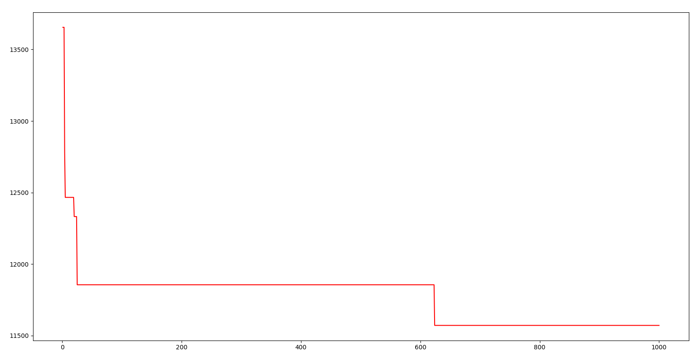
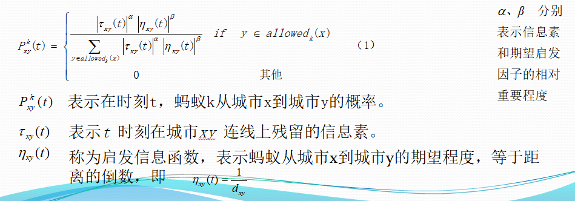

# 3 蚁群算法
- [3.1算法介绍](#31算法介绍)
- [3.2实验代码](#32实验代码)
- [3.3实验结果](#33实验结果)
- [3.4实验总结](#34实验总结)
## 3.1算法介绍

蚁群算法（Ant Colony Optimization, ACO），是一种用来在图中寻找优化路径的机率型算法，对蚂蚁行为进行模仿抽象。在求解旅行推销员问题时，蚂蚁随机从某一城市出发，根据城市间距离与残留信息素浓度按概率选择下一城市，蚂蚁走完所有的城市后，在走过的路径上留下信息素，蚂蚁走的总路程越少，留下的信息素就越多。多次循环后，最好的路径就有可能被筛选出。

其核心原理在于单位时间内通过短距离的路径的次数要多，也就会留下更浓信息素，而蚂蚁会选择信息素浓的路径，这样根据信息素的浓度就能找到最短路径，非常适合解决TSP问题。

## 3.2实验代码

```python
import math
import random
import matplotlib.pyplot as plt
#读取数据
f=open("test.txt")
data=f.readlines()
#将cities初始化为字典，防止下面被当成列表
cities={}
for line in data:
    #原始数据以\n换行，将其替换掉
    line=line.replace("\n","")
    #最后一行以EOF为标志，如果读到就证明读完了，退出循环
    if(line=="EOF"):
        break
    #空格分割城市编号和城市的坐标
    city=line.split(" ")
    map(int,city)
    #将城市数据添加到cities中
    cities[eval(city[0])]=[eval(city[1]),eval(city[2])]
#计算适应度，也就是距离分之一，这里用伪欧氏距离
#用于决定释放多少信息素
def calcfit(addr):
    sum=0
    for i in range(-1,len(addr)-1):
        nowcity=addr[i]
        nextcity=addr[i+1]
        nowloc=cities[nowcity]
        nextloc=cities[nextcity]
        sum+=math.sqrt(((nowloc[0]-nextloc[0])**2+(nowloc[1]-nextloc[1])**2)/10)
    #最后要回到初始城市
    return 1/sum
#计算两个城市的距离，用于启发信息计算
def calc2c(c1,c2):
    #cities是一个字典，key是城市编号，value是一个两个元素的list，分别是x y的坐标
    return math.sqrt((cities[c1][0]-cities[c2][0])**2+(cities[c1][1]-cities[c2][1])**2)


#方便从1开始，所以0-48共49个数字
#全部初始化为1，否则后面的概率可能因为乘以0而全为0
#信息素浓度表
matrix=[[1 for i in range(49)] for i in range(49)]

#蚂蚁的类，实现了根据信息素和启发信息完成一次遍历
class Ant:
    def __init__(self):
        #tabu是已经走过的城市
        #规定从第一个城市开始走
        self.tabu=[1]
        self.allowed=[i for i in range(2,49)]
        self.nowCity=1
        #a,b分别表示信息素和期望启发因子的相对重要程度
        self.a=2
        self.b=7
        #rho表示路径上信息素的挥发系数，1-rho表示信息素的持久性系数。
        self.rho=0.1
        #本条路线的适应度，距离分之一
        self.fit=0
    #计算下一个城市去哪
    def next(self):
        sum=0
        #用一个数组储存下一个城市的概率
        p=[0 for i in range(49)]
        #计算分母和分子
        for c in self.allowed:
            tmp=math.pow(matrix[self.nowCity][c],self.a)*math.pow(1/calc2c(self.nowCity,c),self.b)
            sum+=tmp
            #此处p是分子
            p[c]=tmp
        #更新p为概率
        for c in self.allowed:
            p[c]=p[c]/sum
        #更新p为区间
        for i in range(1,49):
            p[i]+=p[i-1]
        r=random.random()
        for i in range(48):
            if(r<p[i+1] and r>p[i]):
                #i+1即为下一个要去的城市
                self.tabu.append(i+1)
                self.allowed.remove(i+1)
                self.nowCity=i+1
                return
    #将所有城市遍历
    def tour(self):
        while(self.allowed):
            self.next()
        self.fit=calcfit(self.tabu)


    #更新信息素矩阵
    def updateMatrix(self):
        #line储存本次经历过的城市
        line=[]
        for i in range(47):
            #因为矩阵是对阵的，2-1和1-2应该有相同的值，所以两个方向都要加
            line.append([self.tabu[i],self.tabu[i+1]])
            line.append([self.tabu[i+1],self.tabu[i]])
        for i in range(1,49):
            for j in range(1,49):
                if([i,j] in line):
                    matrix[i][j]=(1-self.rho)*matrix[i][j]+self.fit
                else:
                    matrix[i][j]=(1-self.rho)*matrix[i][j]
    #一只蚂蚁复用，每次恢复初始状态
    def clear(self):
        self.tabu=[1]
        self.allowed=[i for i in range(2,49)]
        self.nowCity=1
        self.fit=0


#蚁群算法的类，实现了算法运行过程
class ACO:
    def __init__(self):
        #初始先随机N只蚂蚁
        self.initN=200
        self.bestTour=[i for i in range(1,49)]
        self.bestFit=calcfit(self.bestTour)
        self.initAnt()

    def initAnt(self):
        i=0
        tmpAnt=Ant()
        print(self.initN,"只先锋蚂蚁正在探路")
        while(i<self.initN):
            i+=1
            tmpTour=[i for i in range(1,49)]
            random.shuffle(tmpTour)
            tmpAnt.tabu=tmpTour
            tmpAnt.allowed=[]
            tmpAnt.updateMatrix()
            tmpFit=calcfit(tmpAnt.tabu)
            if(tmpFit>self.bestFit):
                self.bestFit=tmpFit
                self.bestTour=tmpAnt.tabu
            tmpAnt.clear()

    #n为蚂蚁数量
    def startAnt(self,n):
        i=0
        ant=Ant()
        Gen=[]  #迭代次数
        dist=[] #距离，这两个列表是为了画图
        while(i<n):
            i+=1
            ant.tour()
            if(ant.fit>self.bestFit):
                self.bestFit=ant.fit
                self.bestTour=ant.tabu
            print(i,":",1/self.bestFit)
            ant.clear()
            Gen.append(i)
            dist.append(1/self.bestFit)
        #绘制求解过程曲线
        plt.plot(Gen,dist,'-r')
        plt.show()
            #达到阈值后更改策略，对信息素的倾向更大
        #     if(1/self.bestFit<36000):
        #
        #         ant.a=5
        #         ant.b=2
        #         break
        # while(i<n):
        #     i+=1
        #     ant.tour()
        #     if(ant.fit>self.bestFit):
        #         self.bestFit=ant.fit
        #         self.bestTour=ant.tabu
        #     print(i,":",1/self.bestFit)
        #     ant.clear()


a=ACO()
a.startAnt(1000)
```

## 3.3实验结果

下面是放置1000只蚂蚁的结果，计算出最优解是10967.



为防止实验的偶然性，下面进行10次重复实验并求平均值





上图横坐标是放出的蚂蚁数，纵坐标是信息素浓度最大的路径的距离。可以看出其收敛得非常快。

## 3.4实验总结

1、群算法的不难看出其非常适合求解最短距离问题，因此在三个算法中，ACO无论是算法的稳定性，还是最优解的距离长度都是最好的。不仅如此，它的运行速度也是另外两者无法匹敌的。还有，GA和PSO都要维持一个群体，而ACO只需要一只蚂蚁就能完成任务，占用内存更小。可见，ACO在算法的时间复杂度，空间复杂度，解的质量等各个方面都完胜另外两个算法。

2、初始状态时每条路的信息素浓度相等，所以蚂蚁的选择会有随机性。随机的选择也需要在每个路口进行判断，而这种判断是无意义，因为并不能选出信息素浓度高的。所以，我在初始时将若干只蚂蚁指定随机的几条路，这样能防止无意义的判断，并在算法正式开始时各条路上已经存在具有指示性的信息素。

3、蚂蚁选择路线并不是只依靠信息素，还有一个启发信息。启发信息也就是距离下一个城市的距离，蚂蚁会趋向于选择更近的城市。



我在进行信息素和期望启发因子的重要程度参数调优时发现期望启发因子的重要程度会影响解的收敛速度。当启发信息的权重越大，收敛得就会越快，而当启发信息权重很小时，就会收敛得很慢。通过观察公式，不难发现，启发信息权重越大，算法就越趋向于贪婪算法，也就是说一部分城市序列得最优解可以用贪婪算法求。这可以给遗传算法和粒子群寻优的初始群体的确定一定的启发。也就是说贪婪算法求出的位置比随机分布更接近解，从而节省从随机位置到趋近解这一过程所消耗的时间。

同时，对于蚁群算法的优化，我提出一种猜想。初始阶段较大的启发信息权重有助于解的快速收敛，而到后面时则会影响找到最优解。所以可以在初始阶段设置较大的启发信息权重，让解快速收敛，到了后面再降低其权重，让算法变为以信息素为主要导向的，以此来加快逼近最优解的速度。也就是说在两个阶段动态调整信息素和期望启发因子的重要程度。

4、一只蚂蚁是如何实现众多蚂蚁的行为的？

真实世界的蚂蚁是在同一时间有蚁群蚂蚁经过几条路线，因为单位时间内通过的蚂蚁数量不同，而造成每条路的信息素浓度不同。而在算法实现时并没有模拟很多蚂蚁。

算法所模拟的是一只蚂蚁，在走完全程时，对其经过的所有城市之间施加相同的信息素值，这个值是该次行程的距离分之一。每次进行的只是一只蚂蚁。

仔细想想我们就会发现其实两者所达到的效果是一样的。尽管一个是同时有很多蚂蚁在行走，另一个是同一时间只有一只蚂蚁在行走。但是他们施加信息素的方式也不同，一个是经过蚂蚁的多少决定，另一个是该条路的距离决定。这两方面的不同所导致的结果是一样的，并且模拟一只蚂蚁更加简便，容易实现。