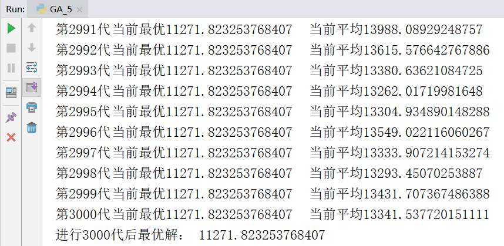
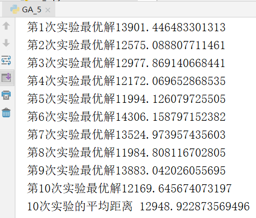
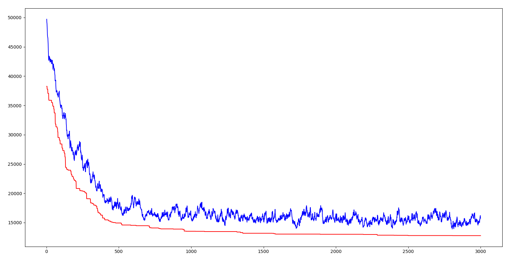

# 1 遗传算法
- [1.1算法介绍](#11算法介绍)
- [1.2实验代码](#12实验代码)
- [1.3实验结果](#13实验结果)
- [1.4实验总结](#14实验总结)
## 1.1算法介绍

遗传算法是模仿自然界生物进化机制发展起来的随机全局搜索和优化方法，它借鉴了达尔文的进化论和孟德尔的遗传学说。其本质是一种高效、并行、全局搜索的方法，它能在搜索过程中自动获取和积累有关搜索空间的知识，并自适应的控制搜索过程以求得最优解。遗传算法操作使用适者生存的原则，在潜在的解决方案种群中逐次产生一个近似最优解的方案，在遗传算法的每一代中，根据个体在问题域中的适应度值和从自然遗传学中借鉴来的再造方法进行个体选择，产生一个新的近似解。这个过程导致种群中个体的进化，得到的新个体比原来个体更能适应环境，就像自然界中的改造一样。

遗传算法具体步骤：

- （1）初始化：设置进化代数计数器t=0、设置最大进化代数T、交叉概率、变异概率、随机生成M个个体作为初始种群P
- （2）个体评价：计算种群P中各个个体的适应度
- （3）选择运算：将选择算子作用于群体。以个体适应度为基础，选择最优个体直接遗传到下一代或通过配对交叉产生新的个体再遗传到下一代
- （4）交叉运算：在交叉概率的控制下，对群体中的个体两两进行交叉
- （5）变异运算：在变异概率的控制下，对群体中的个体进行变异，即对某一个体的基因进行随机调整
- （6） 经过选择、交叉、变异运算之后得到下一代群体P1。

重复以上（1）-（6），直到遗传代数为 T，以进化过程中所得到的具有最优适应度个体作为最优解输出，终止计算。

旅行推销员问题（Travelling Salesman Problem， TSP）：有n个城市，一个推销员要从其中某一个城市出发，唯一走遍所有的城市，再回到他出发的城市，求最短的路线。

应用遗传算法求解TSP问题时需要进行一些约定，基因是一组城市序列，适应度是按照这个基因的城市顺序的距离和分之一。

## 1.2实验代码

```python
import random
import math
import matplotlib.pyplot as plt
#读取数据
f=open("test.txt")
data=f.readlines()
#将cities初始化为字典，防止下面被当成列表
cities={}
for line in data:
    #原始数据以\n换行，将其替换掉
    line=line.replace("\n","")
    #最后一行以EOF为标志，如果读到就证明读完了，退出循环
    if(line=="EOF"):
        break
    #空格分割城市编号和城市的坐标
    city=line.split(" ")
    map(int,city)
    #将城市数据添加到cities中
    cities[eval(city[0])]=[eval(city[1]),eval(city[2])]

#计算适应度，也就是距离分之一，这里用伪欧氏距离
def calcfit(gene):
    sum=0
    #最后要回到初始城市所以从-1，也就是最后一个城市绕一圈到最后一个城市
    for i in range(-1,len(gene)-1):
        nowcity=gene[i]
        nextcity=gene[i+1]
        nowloc=cities[nowcity]
        nextloc=cities[nextcity]
        sum+=math.sqrt(((nowloc[0]-nextloc[0])**2+(nowloc[1]-nextloc[1])**2)/10)

    return 1/sum

#每个个体的类，方便根据基因计算适应度
class Person:
    def __init__(self,gene):
        self.gene=gene
        self.fit=calcfit(gene)
class Group:
    def __init__(self):
        self.GroupSize=100  #种群规模
        self.GeneSize=48    #基因数量，也就是城市数量
        self.initGroup()
        self.upDate()
    #初始化种群，随机生成若干个体
    def initGroup(self):
        self.group=[]
        i=0
        while(i<self.GroupSize):
            i+=1
            #gene如果在for以外生成只会shuffle一次
            gene=[i+1 for i in range(self.GeneSize)]
            random.shuffle(gene)
            tmpPerson=Person(gene)
            self.group.append(tmpPerson)

    #获取种群中适应度最高的个体
    def getBest(self):
        bestFit=self.group[0].fit
        best=self.group[0]
        for person in self.group:
            if(person.fit>bestFit):
                bestFit=person.fit
                best=person
        return best
    #计算种群中所有个体的平均距离
    def getAvg(self):
        sum=0
        for p in self.group:
            sum+=1/p.fit
        return sum/len(self.group)
    #根据适应度，使用轮盘赌返回一个个体，用于遗传交叉
    def getOne(self):
        #section的简称，区间
        sec=[0]
        sumsec=0
        for person in self.group:
            sumsec+=person.fit
            sec.append(sumsec)
        p=random.random()*sumsec
        for i in range(len(sec)):
            if(p>sec[i] and p<sec[i+1]):
                #这里注意区间是比个体多一个0的
                return self.group[i]
    #更新种群相关信息
    def upDate(self):
        self.best=self.getBest()
#遗传算法的类，定义了遗传、交叉、变异等操作
class GA:
    def __init__(self):
        self.group=Group()
        self.pCross=0.35    #交叉率
        self.pChange=0.1    #变异率
        self.Gen=1  #代数

    #变异操作
    def change(self,gene):
        #把列表随机的一段取出然后再随机插入某个位置
        #length是取出基因的长度，postake是取出的位置，posins是插入的位置
        geneLenght=len(gene)
        index1 = random.randint(0, geneLenght - 1)
        index2 = random.randint(0, geneLenght - 1)
        newGene = gene[:]       # 产生一个新的基因序列，以免变异的时候影响父种群
        newGene[index1], newGene[index2] = newGene[index2], newGene[index1]
        return newGene

    #交叉操作
    def cross(self,p1,p2):
        geneLenght=len(p1.gene)
        index1 = random.randint(0, geneLenght - 1)
        index2 = random.randint(index1, geneLenght - 1)
        tempGene = p2.gene[index1:index2]   # 交叉的基因片段
        newGene = []
        p1len = 0
        for g in p1.gene:
              if p1len == index1:
                    newGene.extend(tempGene)     # 插入基因片段
                    p1len += 1
              if g not in tempGene:
                    newGene.append(g)
                    p1len += 1
        return newGene

    #获取下一代
    def nextGen(self):
        self.Gen+=1
        #nextGen代表下一代的所有基因
        nextGen=[]
        #将最优秀的基因直接传递给下一代
        nextGen.append(self.group.getBest().gene[:])
        while(len(nextGen)<self.group.GroupSize):
            pChange=random.random()
            pCross=random.random()
            p1=self.group.getOne()
            if(pCross<self.pCross):
                p2=self.group.getOne()
                newGene=self.cross(p1,p2)
            else:
                newGene=p1.gene[:]
            if(pChange<self.pChange):
                newGene=self.change(newGene)
            nextGen.append(newGene)
        self.group.group=[]
        for gene in nextGen:
            self.group.group.append(Person(gene))
            self.group.upDate()

    #打印当前种群的最优个体信息
    def showBest(self):
        print("第{}代\t当前最优{}\t当前平均{}\t".format(self.Gen,1/self.group.getBest().fit,self.group.getAvg()))

    #n代表代数，遗传算法的入口
    def run(self,n):
        Gen=[]  #代数
        dist=[] #每一代的最优距离
        avgDist=[]  #每一代的平均距离
        #上面三个列表是为了画图
        i=1
        while(i<n):
            self.nextGen()
            self.showBest()
            i+=1
            Gen.append(i)
            dist.append(1/self.group.getBest().fit)
            avgDist.append(self.group.getAvg())
        #绘制进化曲线
        plt.plot(Gen,dist,'-r')
        plt.plot(Gen,avgDist,'-b')
        plt.show()

ga=GA()
ga.run(3000)
print("进行3000代后最优解：",1/ga.group.getBest().fit)
```

## 1.3实验结果

下图是进行一次实验的结果截图，求出的最优解是11271



为避免实验的偶然性，进行10次重复实验，并求平均值，结果如下。





上图横坐标是代数，纵坐标是距离，红色曲线是每一代的最优个体的距离，蓝色曲线是每一代的平均距离。可以看出两条线都呈下降趋势，也就是说都在进化。平均距离下降说明由于优良基因的出现（也就是某一段城市序列），使得这种优良的性状很快传播到整个群体。就像自然界中的优胜劣汰一样，具有适应环境的基因才能生存下来，相应的，生存下来的都是具有优良基因的。算法中引入交叉率和变异率的意义就在于既要保证当前优良基因，又要试图产生更优良的基因。如果所有个体都交叉，那么有些优良的基因片段可能会丢失；如果都不交叉，那么两个优秀的基因片段无法组合为更优秀的基因；如果没有变异，那就无法产生更适应环境的个体。不得不感叹自然的智慧是如此强大。

上面说到的基因片段就是TSP中的一小段城市序列，当某一段序列的距离和相对较小时，就说明这段序列是这几个城市的相对较好的遍历顺序。遗传算法通过将这些优秀的片段组合起来实现了TSP解的不断优化。而组合的方法正是借鉴自然的智慧，遗传、变异、适者生存。

## 1.4实验总结

1、如何在算法中实现“优胜劣汰”？

所谓优胜劣汰也就是优良的基因保留，不适应环境的基因淘汰。在上述GA算法中，我使用的是轮盘赌，也就是在遗传的步骤中（无论是否交叉），根据每个个体的适应度来挑选。这样就能达到适应度高得个体有更多的后代，也就达到了优胜劣汰的目的。

在具体的实现过程中，我犯了个错误，起初在遗传步骤筛选个体时，我每选出一个个体就将这个个体从群体中删除。现在想想，这种做法十分愚蠢，尽管当时我已经实现了轮盘赌，但如果选出个体就删除，那么就会导致每个个体都会平等地生育后代，所谓的轮盘赌也不过是能让适应度高的先进行遗传。这种做法完全背离了“优胜劣汰”的初衷。正确的做法是选完个体进行遗传后再重新放回群体，这样才能保证适应度高的个体会进行多次遗传，产生更多后代，将优良的基因更广泛的播撒，同时不适应的个体会产生少量后代或者直接被淘汰。

2 、如何保证进化一直是在正向进行？

所谓正向进行也就是下一代的最优个体一定比上一代更适应或者同等适应环境。我采用的方法是最优个体直接进入下一代，不参与交叉变异等操作。这样能够防止因这些操作而“污染”了当前最优秀的基因而导致反向进化的出现。

我在实现过程中还出现了另一点问题，是传引用还是传值所导致的。对个体的基因进行交叉和变异时用的是一个列表，Python中传列表时传的实际上是一个引用，这样就导致个体进行交叉和变异后会改变个体本身的基因。导致的结果就是进化非常缓慢，并且伴随反向进化。

3、交叉如何实现？

选定一个个体的片段放入另一个体，并将不重复的基因的依次放入其他位置。

在实现这一步时，因为学生物时对真实染色体行为的固有认识，“同源染色体交叉互换同源区段”，导致我错误实现该功能。我只将两个个体的相同位置的片段互换来完成交叉，显然这样的做法是错误的，这会导致城市的重复出现。

4、在刚开始写这个算法时，我是半OOP，半面向过程地写。后续测试过程中发现要改参数，更新个体信息时很麻烦，于是全部改为OOP，然后方便多了。对于这种模拟真实世界的问题，OOP有很大的灵活性和简便性。

5、如何防止出现局部最优解？

在测试过程中发现偶尔会出现局部最优解，在很长时间内不会继续进化，而此时的解又离最优解较远。哪怕是后续调整后，尽管离最优解近了，但依然是“局部最优”，因为还没有达到最优。

算法在起初会收敛得很快，而越往后就会越来越慢，甚至根本不动。因为到后期，所有个体都有着相对来说差不多的优秀基因，这时的交叉对于进化的作用就很弱了，进化的主要动力就成了变异，而变异就是一种暴力算法了。运气好的话能很快变异出更好的个体，运气不好就得一直等。

防止局部最优解的解决方法是增大种群规模，这样就会有更多的个体变异，就会有更大可能性产生进化的个体。而增大种群规模的弊端是每一代的计算时间会变长，也就是说这两者是相互抑制的。巨大的种群规模虽然最终能避免局部最优解，但是每一代的时间很长，需要很长时间才能求出最优解；而较小的种群规模虽然每一代计算时间快，但在若干代后就会陷入局部最优。

猜想一种可能的优化方法，在进化初期用较小的种群规模，以此来加快进化速度，当适应度达到某一阈值后，增加种群规模和变异率来避免局部最优解的出现。用这种动态调整的方法来权衡每一代计算效率和整体计算效率之间的平衡。