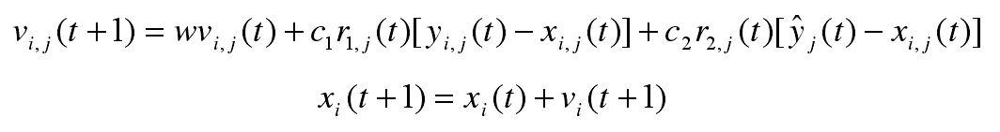
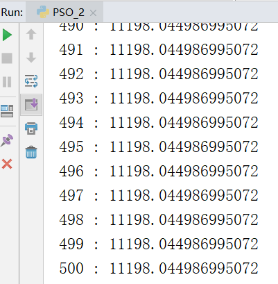
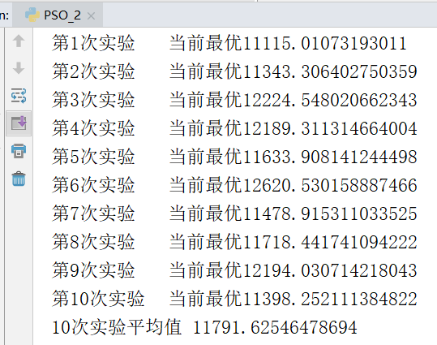
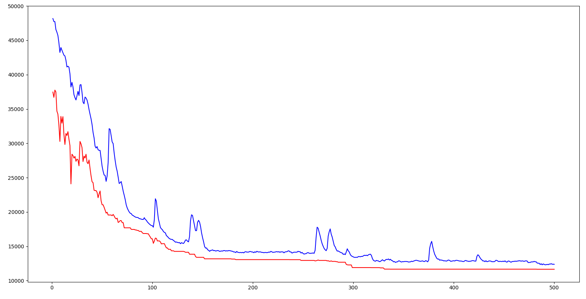

# 2 粒子群寻优
- [1.1算法介绍](#11----)
- [1.2实验代码](#12----)
- [1.3实验结果](#13----)
- [1.4实验总结](#14----)
## 2.1算法介绍

粒子群算法（particle swarm optimization，PSO）的思想源于对鸟/鱼群捕食行为的研究，模拟鸟集群飞行觅食的行为，鸟之间通过集体的协作使群体达到最优目的。

粒子群寻优算法作以下假设：

1. 每个寻优的问题解都被想像成一只鸟，称为“粒子”。所有粒子都在一个D维空间进行搜索。
2. 所有的粒子都由一个fitness function 确定适应值以判断目前的位置好坏。
3. 每一个粒子必须赋予记忆功能，能记住所搜寻到的最佳位置。
4. 每一个粒子还有一个速度以决定飞行的距离和方向。这个速度根据它本身的飞行经验以及同伴的飞行经验进行动态调整。

传统的粒子群寻优算法的位置更新公式如下



每一只鸟会根据自身速度惯性、自身最佳位置和群体最佳位置来决定下一时刻的速度（包括大小和方向），并根据速度来更新位置。

当应用PSO来解决TSP问题时需要进行一些改进，将多维的城市列表信息转换为一种坐标信息，并在此基础上定义相应的速度、加速度等。这些研究在卞锋的《粒子群优化算法在TSP中的研究及应用》和《求解TSP的改进QPSO算法》两篇文章中有详细介绍。其中最重要的一个概念是交换序，相当于传统PSO中的速度。在进行了这些改进之后就可以将PSO算法应用于TSP问题中了。

## 2.2实验代码

```python
import random
import math
import matplotlib.pyplot as plt
#读取数据
f=open("test.txt")
data=f.readlines()
#将cities初始化为字典，防止下面被当成列表
cities={}
for line in data:
    #原始数据以\n换行，将其替换掉
    line=line.replace("\n","")
    #最后一行以EOF为标志，如果读到就证明读完了，退出循环
    if(line=="EOF"):
        break
    #空格分割城市编号和城市的坐标
    city=line.split(" ")
    map(int,city)
    #将城市数据添加到cities中
    cities[eval(city[0])]=[eval(city[1]),eval(city[2])]
#计算适应度，也就是距离分之一，这里用伪欧氏距离
def calcfit(addr):
    sum=0
    for i in range(-1,len(addr)-1):
        nowcity=addr[i]
        nextcity=addr[i+1]
        nowloc=cities[nowcity]
        nextloc=cities[nextcity]
        sum+=math.sqrt(((nowloc[0]-nextloc[0])**2+(nowloc[1]-nextloc[1])**2)/10)
    #最后要回到初始城市
    return 1/sum

#生成交换序的函数，交换后数组b变为a，也就是a-b的结果
def switchB2A(a,b):
    #防止传进来的b被更改
    tmpb=b[:]
    q=[]
    for i in range(len(a)):
        if(a[i]!=tmpb[i]):
            j=b.index(a[i])
            q.append([i,j])
            #刚学的简洁的交换list的方法
            tmpb[j],tmpb[i]=tmpb[i],tmpb[j]
    return q

#w*v，w是一个数，v是一个数组。w乘v的数组长度，然后对结果取整，取数组的前这么多个元素
def multiply(w,v):
    l=int(w*len(v))
    res=v[0:l]
    return res

#鸟个体的类，实现鸟位置的移动
class Bird:
    def __init__(self,addr):
        self.addr=addr
        self.v=0
        #初始化时自己曾遇到得最优位置就是初始化的位置
        self.bestAddr=addr
        #初始状态没有速度
        self.v=[]
        self.fit=calcfit(self.addr)
        self.bestFit=self.fit

    #根据交换序移动位置
    def switch(self,switchq):
        for pair in switchq:
            i,j=pair[0],pair[1]
            self.addr[i],self.addr[j]=self.addr[j],self.addr[i]
        #交换后自动更行自己的成员变量
        self.upDate()

    #更新鸟自身相关信息
    def upDate(self):
        newfit=calcfit(self.addr)
        self.fit=newfit
        if(newfit>self.bestFit):
            self.bestFit=newfit
            self.bestAddr=self.addr

    #变异操作
    #设置变异后避免了所有鸟都聚集到一个离食物近，但又不是最近的地方，并且就停在那里不动了
    def change(self):
        i,j=random.randrange(0,48),random.randrange(0,48)
        self.addr[i],self.addr[j]=self.addr[j],self.addr[i]
        self.upDate()
    #贪婪倒立变异
    def reverse(self):
        #随机选择一个城市
        cityx=random.randrange(1,49)
        noxcity=self.addr[:]
        noxcity.remove(cityx)
        maxFit=0
        nearCity=noxcity[0]
        for c in noxcity:
            fit=calcfit([c,cityx])
            if(fit>maxFit):
                maxFit=fit
                nearCity=c
        index1=self.addr.index(cityx)
        index2=self.addr.index(nearCity)
        tmp=self.addr[index1+1:index2+1]
        tmp.reverse()
        self.addr[index1+1:index2+1]=tmp
        self.upDate()

#种群的类，里面有很多鸟
class Group:
    def __init__(self):
        self.groupSize=500  #鸟的个数、粒子个数
        self.addrSize=48    #位置的维度，也就是TSP城市数量
        self.w=0.25 #w为惯性系数，也就是保留上次速度的程度
        self.pChange=0.1    #变异系数pChange
        self.pReverse=0.1   #贪婪倒立变异概率
        self.initBirds()
        self.best=self.getBest()
        self.Gen=0
    #初始化鸟群
    def initBirds(self):
        self.group=[]
        for i in range(self.groupSize):
            addr=[i+1 for i in range(self.addrSize)]
            random.shuffle(addr)
            bird=Bird(addr)
            self.group.append(bird)
    #获取当前离食物最近的鸟
    def getBest(self):
        bestFit=0
        bestBird=None
        #遍历群体里的所有鸟，找到路径最短的
        for bird in self.group:
            nowfit=calcfit(bird.addr)
            if(nowfit>bestFit):
                bestFit=nowfit
                bestBird=bird
        return bestBird
    #返回所有鸟的距离平均值
    def getAvg(self):
        sum=0
        for p in self.group:
            sum+=1/p.fit
        return sum/len(self.group)
    #打印最优位置的鸟的相关信息
    def showBest(self):
        print(self.Gen,":",1/self.best.fit)
    #更新每一只鸟的速度和位置
    def upDateBird(self):
        self.Gen+=1
        for bird in self.group:
            #g代表group，m代表me，分别代表自己和群组最优、自己最优的差
            deltag=switchB2A(self.best.addr,bird.addr)
            deltam=switchB2A(bird.bestAddr,bird.addr)
            newv=multiply(self.w,bird.v)[:]+multiply(random.random(),deltag)[:]+multiply(random.random(),deltam)
            bird.switch(newv)
            bird.v=newv
            if(random.random()<self.pChange):
                bird.change()
            if(random.random()<self.pReverse):
                bird.reverse()
            #顺便在循环里把最优的鸟更新了，防止二次遍历
            if(bird.fit>self.best.fit):
                self.best=bird

Gen=[]  #代数
dist=[] #距离
avgDist=[]  #平均距离
#上面三个列表是为了画图
group=Group()
i=0
#进行若干次迭代
while(i<500):
    i+=1
    group.upDateBird()
    group.showBest()
    Gen.append(i)
    dist.append(1/group.getBest().fit)
    avgDist.append(group.getAvg())
#将过程可视化
plt.plot(Gen,dist,'-r')
plt.plot(Gen,avgDist,'-b')
plt.show()
```

## 2.3实验结果

下面是进行500次迭代后的结果，求出的最优解是11198



为避免计算过程的偶然性，下面进行10次重复实验并求平均值。





上图横坐标是迭代次数，纵坐标是距离，红色曲线是每次迭代最接近食物的鸟（也就是本次迭代的最优解，食物的位置也就是最优解城市序列所构成的坐标），蓝色曲线是每次迭代所有鸟的平均距离。可以看出不同于遗传算法，最初的最优解具有波动性，并不是一直下降的（遗传算法之所以一直下降是因为每次都保留的最优个体直接传到下一代）出现这种情况的原因是，最开始阶段所有鸟都是随机分散的，大家离食物的距离都差不多，就算是距离食物最近的鸟其能提供的信息的参考价值也不大。所以在开始的一段时间内最优位置的鸟在波动，而到后期，当食物位置更加确定之后，其波动性就消失了。

从趋势来看，无论是每次迭代的最优距离还是大家的平均距离，整体都是呈现下降趋势的，也就是说整个群体都是在朝着食物的位置移动。

## 2.4实验总结

1、在阅读完卞锋的两篇文章，并用他的方法将PSO应用于解决TSP问题后，让我认识到原来一种算法并不是拘泥于解决特定的一类问题，将算法与实际情况相结合，然后进行抽象和类比就能应用于新的问题的解决。这种抽象和类比的思维非常让我惊讶，我要好好学习。

2、引入遗传算法的变异操作

起初完成PSO时，测试发现很容易陷入离最优解较远的局部最优。在参考卞锋的《求解TSP的改进QPSO算法》后引入相关变异操作，从而解决了这个问题。

他提出的贪婪倒立变异很有意思。贪婪倒立变异是指找到一个城市，再找到离他最近的城市，然后将城市序列中两个城市之间的序列进行倒序排列。这样能够在实现优化了所选两个城市的距离的同时，保证其他城市顺序尽量不变化。

不知道作者是怎么想到这种变异方法的。我在看完文章后首先想到的是染色体变异中的倒位，也就是染色体中的一段旋转180度放回原来位置。染色体的倒位变异和作者提到的贪婪倒立变异非常相似。可能作者也是借鉴自然界的染色体变异吧，再次感叹自然界的智慧无穷。

传统的PSO没有变异操作，这种引入变异的操作是借鉴遗传算法的。可见吸收借鉴其他算法的精华，能够提升自身算法的效率。