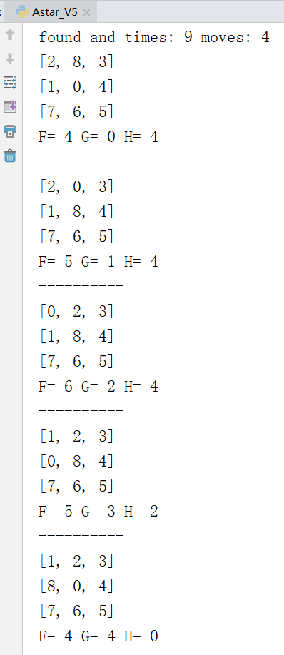
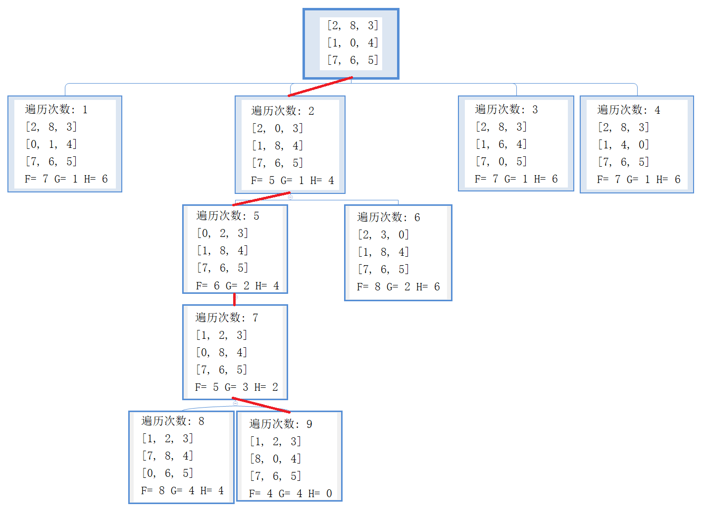
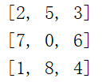
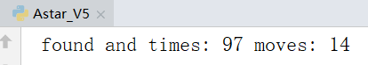
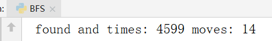

# A*算法实现8数码问题
- [3.1算法介绍](#31算法介绍)
- [3.2实验代码](#32实验代码)
- [3.3实验结果](#33实验结果)
- [3.4实验总结](#34实验总结)
## 3.1算法介绍

Astar算法是一种求解最短路径最有效的直接搜索方法，也是许多其他问题的常用启发式算法。它的启发函数为f(n)=g(n)+h(n),其中，f(n) 是从初始状态经由状态n到目标状态的代价估计，g(n) 是在状态空间中从初始状态到状态n的实际代价，h(n) 是从状态n到目标状态的最佳路径的估计代价。

h(n)是启发函数中很重要的一项，它是对当前状态到目标状态的最小代价(n)的一种估计，且需要满足 h(n)<=h*(n)

也就是说h(n)是h*(n)的下界，这一要求保证了Astar算法能够找到最优解。这一点很容易想清楚，因为满足了这一条件后，启发函数的值总是小于等于最优解的代价值，也就是说寻找过程是在朝着一个可能是最优解的方向或者是比最优解更小的方向移动，如果启发函数值恰好等于实际最优解代价值，那么搜索算法在一直尝试逼近最优解的过程中会找到最优解；如果启发函数值比最优解的代价要低，虽然无法达到，但是因为方向一致，会在搜索过程中发现最优解。

h是由我们自己设计的，h函数设计的好坏决定了Astar算法的效率。h值越大，算法运行越快。但是在设计评估函数时，需要注意一个很重要的性质：评估函数的值一定要小于等于实际当前状态到目标状态的代价。否则虽然程序运行速度加快，但是可能在搜索过程中漏掉了最优解。相对的，只要评估函数的值小于等于实际当前状态到目标状态的代价，就一定能找到最优解。所以，在这个问题中我们可以将评估函数设定为1-8八数字当前位置到目标位置的曼哈顿距离之和。

Astar算法与BFS算法的不同之处在于每次会根据启发函数的值来进行排序，每次先出队的是启发函数值最小的状态。

Astar算法可以被认为是Dijkstra算法的扩展。Dijkstra算法在搜索最短距离时是已知了各个节点之间的距离，而对于Astar而言，这个已知的距离被启发函数值替换。

## 3.2实验代码

```python
import copy
#棋盘的类，实现移动和扩展状态
class grid:
    def __init__(self,stat):
        self.pre=None
        #目标状态
        self.target=[[1,2,3],[8,0,4],[7,6,5]]
        #stat是一个二维列表
        self.stat=stat
        self.find0()
        self.update()
    #更新启发函数的相关信息
    def update(self):
        self.fH()
        self.fG()
        self.fF()

    #G是深度，也就是走的步数
    def fG(self):
        if(self.pre!=None):
            self.G=self.pre.G+1
        else:
            self.G=0

    #H是和目标状态距离之和
    def fH(self):
        self.H=0
        for i in range(3):
            for j in range(3):
                targetX=self.target[i][j]
                nowP=self.findx(targetX)
                #曼哈顿距离之和
                self.H+=abs(nowP[0]-i)+abs(nowP[1]-j)

    #F是启发函数，F=G+H
    def fF(self):
        self.F=self.G+self.H

    #以三行三列的形式输出当前状态
    def see(self):
        for i in range(3):
             print(self.stat[i])
        print("F=",self.F,"G=",self.G,"H=",self.H)
        print("-"*10)

    #查看找到的解是如何从头移动的
    def seeAns(self):
        ans=[]
        ans.append(self)
        p=self.pre
        while(p):
            ans.append(p)
            p=p.pre
        ans.reverse()
        for i in ans:
            i.see()

    #找到数字x的位置
    def findx(self,x):
        for i in range(3):
            if(x in self.stat[i]):
                j=self.stat[i].index(x)
                return [i,j]

    #找到0，也就是空白格的位置
    def find0(self):
            self.zero=self.findx(0)

    #扩展当前状态，也就是上下左右移动。返回的是一个状态列表，也就是包含stat的列表
    def expand(self):
        i=self.zero[0]
        j=self.zero[1]
        gridList=[]
        if(j==2 or j==1):
            gridList.append(self.left())
        if(i==2 or i==1):
            gridList.append(self.up())
        if(i==0 or i==1):
            gridList.append(self.down())
        if(j==0 or j==1):
            gridList.append(self.right())
        return gridList


    #deepcopy多维列表的复制，防止指针赋值将原列表改变
    #move只能移动行或列，即row和col必有一个为0
    #向某个方向移动
    def move(self,row,col):
        newStat=copy.deepcopy(self.stat)
        tmp=self.stat[self.zero[0]+row][self.zero[1]+col]
        newStat[self.zero[0]][self.zero[1]]=tmp
        newStat[self.zero[0]+row][self.zero[1]+col]=0
        return newStat

    def up(self):
        return self.move(-1,0)

    def down(self):
        return self.move(1,0)

    def left(self):
        return self.move(0,-1)

    def right(self):
        return self.move(0,1)

#判断状态g是否在状态集合中，g是对象，gList是对象列表
#返回的结果是一个列表，第一个值是真假，如果是真则第二个值是g在gList中的位置索引
def isin(g,gList):
    gstat=g.stat
    statList=[]
    for i in gList:
        statList.append(i.stat)
    if(gstat in statList):
        res=[True,statList.index(gstat)]
    else:
        res=[False,0]
    return res

#计算逆序数之和
def N(nums):
    N=0
    for i in range(len(nums)):
        if(nums[i]!=0):
            for j in range(i):
                if(nums[j]>nums[i]):
                    N+=1
    return N

#根据逆序数之和判断所给八数码是否可解
def judge(src,target):
    N1=N(src)
    N2=N(target)
    if(N1%2==N2%2):
        return True
    else:
        return False

#Astar算法的函数
def Astar(startStat):
    #open和closed存的是grid对象
    open=[]
    closed=[]
    #初始化状态
    g=grid(startStat)
    #检查是否有解
    if(judge(startStat,g.target)!=True):
        print("所给八数码无解，请检查输入")
        exit(1)

    open.append(g)
    #time变量用于记录遍历次数
    time=0
    #当open表非空时进行遍历
    while(open):
        #根据启发函数值对open进行排序，默认升序
        open.sort(key=lambda G:G.F)
        #找出启发函数值最小的进行扩展
        minFStat=open[0]
        #检查是否找到解，如果找到则从头输出移动步骤
        if(minFStat.H==0):
            print("found and times:",time,"moves:",minFStat.G)
            minFStat.seeAns()
            break

        #走到这里证明还没有找到解，对启发函数值最小的进行扩展
        open.pop(0)
        closed.append(minFStat)
        expandStats=minFStat.expand()
        #遍历扩展出来的状态
        for stat in expandStats:
            #将扩展出来的状态（二维列表）实例化为grid对象
            tmpG=grid(stat)
            #指针指向父节点
            tmpG.pre=minFStat
            #初始化时没有pre，所以G初始化时都是0
            #在设置pre之后应该更新G和F
            tmpG.update()
            #查看扩展出的状态是否已经存在与open或closed中
            findstat=isin(tmpG,open)
            findstat2=isin(tmpG,closed)
            #在closed中,判断是否更新
            if(findstat2[0]==True and tmpG.F<closed[findstat2[1]].F):
                closed[findstat2[1]]=tmpG
                open.append(tmpG)
                time+=1
            #在open中，判断是否更新
            if(findstat[0]==True and tmpG.F<open[findstat[1]].F):
                open[findstat[1]]=tmpG
                time+=1
            #tmpG状态不在open中，也不在closed中
            if(findstat[0]==False and findstat2[0]==False):
                open.append(tmpG)
                time+=1

stat=[[2, 8, 3], [1, 0 ,4], [7, 6, 5]]
Astar(stat)
```

## 3.3实验结果

仍然用相同的例子，用Astar进行搜索。


将找出的解从初始状态一步一步输出到解状态。



从结果中可以看出总共进行了9次遍历，并在第4层时找到了解状态。

下面我们来看一看Astar的所有9次遍历，以此来更深入的理解Astar的原理。稍微对代码进行改动，使其输出遍历次数和当前状态的启发信息（其中F是启发值，G是当前深度，H是不在位棋子的曼哈顿距离之和）。由于结果太长，为了方便展示，下面将以树的形式展示。



上面输出的解就是按照红色路线标注找到的，从遍历次数和相应状态的启发信息可以看出每次对启发函数值最小的状态进行扩展，依次进行搜索。

## 3.4实验总结

从三个算法的遍历次数可以看出Astar算法更加优秀，能够更快的找到解。但是因为上面给出的八数码题目太简单了，只需要4步就能解决问题，所以看起来优势没有那么明显。下面我们选择另一个比较难的，需要更多移动步数的题目，以此来体现启发式搜索相较于盲目搜索的优越性。用三种算法搜索下面八数码的解。



下面是比较的结果






可以看出来Astar在一百次遍历之内就找到了解，而另外两个盲目搜索算法则需要几千次才搜索到。