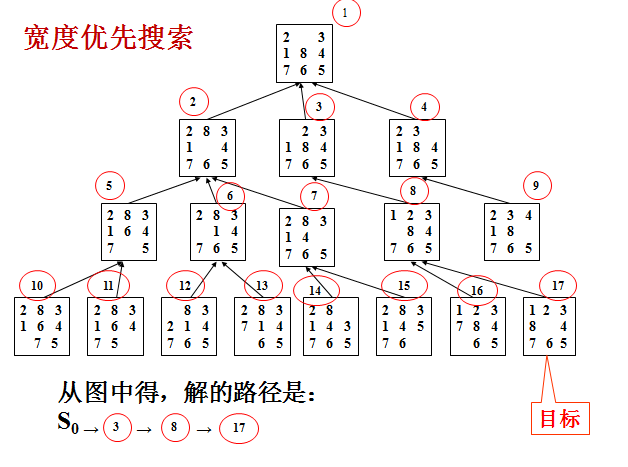
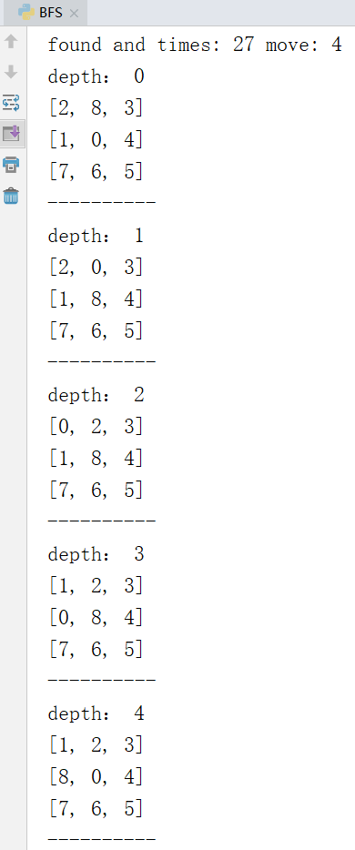
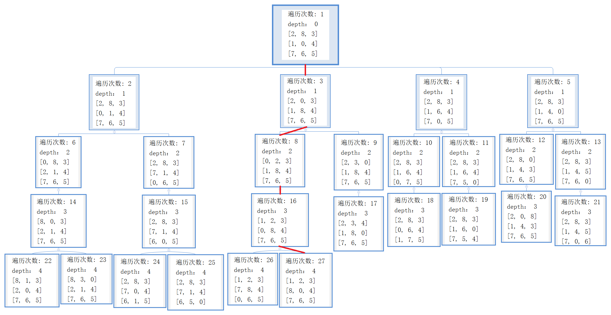

# 2 广度优先遍历搜索(BFS)

[TOC]

## 2.1算法介绍

广度优先搜索算法（英语：Breadth-First-Search，缩写为BFS），是一种图形搜索算法。简单的说，BFS是从根节点开始，沿着树的宽度遍历树的节点。如果所有节点均被访问，则算法中止。BFS是一种盲目搜索法，目的是系统地展开并检查图中的所有节点，以找寻结果。

BFS会先访问根节点的所有邻居节点，然后再依次访问邻居节点的邻居节点，直到所有节点都访问完毕。在具体的实现中，使用open和closed两个表，open是一个队列，每次对open进行一次出队操作（并放入closed中），并将其邻居节点进行入队操作。直到队列为空时即完成了所有节点的遍历。closed表在遍历树时其实没有用，因为子节点只能从父节点到达。但在进行图的遍历时，一个节点可能会由多个节点到达，所以此时为了防止重复遍历应该每次都检查下一个节点是否已经在closed中了。 


依然使用上面的这个例子，如果使用BFS进行遍历，那么节点的访问顺序是“1-2-7-8-3-6-9-12-4-5-10-11”。可以看出来BFS进行遍历时是一层一层的搜索的。



在应用BFS算法进行八数码问题搜索时需要open和closed两个表。首先将初始状态加入open队列，然后进行出队操作并放入closed中，对出队的状态进行扩展（所谓扩展也就是找出其上下左右移动后的状态），将扩展出的状态加入队列，然后继续循环出队-扩展-入队的操作，直到找到解为止。

上图这个例子中，红圈里的数字是遍历顺序。当找到解时一直往前找父节点即可找出求解的移动路线。

## 2.2实验代码

```python
import copy
#棋盘的类，实现移动和扩展状态
class grid:
    def __init__(self,stat):
        self.pre=None
        self.target=[[1,2,3],[8,0,4],[7,6,5]]
        self.stat=stat
        self.find0()
        self.update()
    #更新深度和距离和
    def update(self):
        self.fH()
        self.fG()
    #G是深度，也就是走的步数
    def fG(self):
        if(self.pre!=None):
            self.G=self.pre.G+1
        else:
            self.G=0
    #H是和目标状态距离之和，可以用来判断是否达到最优解
    def fH(self):
        self.H=0
        for i in range(3):
            for j in range(3):
                targetX=self.target[i][j]
                nowP=self.findx(targetX)
                self.H+=abs(nowP[0]-i)+abs(nowP[1]-j)
    #查看当前状态
    def see(self):
        print("depth：",self.G)
        for i in range(3):
             print(self.stat[i])
        print("-"*10)
    #查看找到的解是如何从头移动的
    def seeAns(self):
        ans=[]
        ans.append(self)
        p=self.pre
        while(p):
            ans.append(p)
            p=p.pre
        ans.reverse()
        for i in ans:
            i.see()
    #找到数字x的位置，返回其坐标
    def findx(self,x):
        for i in range(3):
            if(x in self.stat[i]):
                j=self.stat[i].index(x)
                return [i,j]
    #找到0，也就是空白格的位置
    def find0(self):
            self.zero=self.findx(0)
    #对当前状态进行所有可能的扩展，返回一个扩展状态的列表
    def expand(self):
        i=self.zero[0]
        j=self.zero[1]
        gridList=[]

        if(j==2 or j==1):
            gridList.append(self.left())
        if(i==2 or i==1):
            gridList.append(self.up())
        if(i==0 or i==1):
            gridList.append(self.down())
        if(j==0 or j==1):
            gridList.append(self.right())

        return gridList


    #deepcopy多维列表的复制，防止指针赋值将原列表改变
    #move只能移动行或列，即row和col必有一个为0
    #对当前状态进行移动
    def move(self,row,col):
        newStat=copy.deepcopy(self.stat)
        tmp=self.stat[self.zero[0]+row][self.zero[1]+col]
        newStat[self.zero[0]][self.zero[1]]=tmp
        newStat[self.zero[0]+row][self.zero[1]+col]=0
        return newStat

    def up(self):
        return self.move(-1,0)

    def down(self):
        return self.move(1,0)

    def left(self):
        return self.move(0,-1)

    def right(self):
        return self.move(0,1)


#计算逆序数之和
def N(nums):
    N=0
    for i in range(len(nums)):
        if(nums[i]!=0):
            for j in range(i):
                if(nums[j]>nums[i]):
                    N+=1
    return N

#根据逆序数之和判断所给八数码是否可解
def judge(src,target):
    N1=N(src)
    N2=N(target)
    if(N1%2==N2%2):
        return True
    else:
        return False

#初始化状态
startStat=[[2,8,3],[1,0,4],[7,6,5]]
g=grid(startStat)
if(judge(startStat,g.target)!=True):
    print("所给八数码无解，请检查输入")
    exit(1)

visited=[]
queue=[g]
time=0
while(queue):
    time+=1
    v=queue.pop(0)
    #判断是否找到解
    if(v.H==0):
        print("found and times:",time,"moves:",v.G)
        #查看找到的解是如何从头移动的
        v.seeAns()
        break
    else:
        #对当前状态进行扩展
        visited.append(v.stat)
        expandStats=v.expand()
        for stat in expandStats:
            tmpG=grid(stat)
            tmpG.pre=v
            tmpG.update()
            if(stat not in visited):
                queue.append(tmpG)

```

## 2.3实验结果

仍然用相同的例子，用BFS进行搜索。


将找出的解从初始状态一步一步输出到解状态。



从结果中可以看出总共进行了27次遍历，并在第4层时找到了解状态。

下面我们来看一看BFS的所有27次遍历，以此来更深入的理解BFS的原理。稍微对代码进行改动，使其输出遍历次数和当前层数。由于结果太长，为了方便展示，下面将以树的形式展示。



上面输出的解就是按照红色路线标注找到的，从遍历次数可以看出是一层一层的找。

## 2.4实验总结

由于BFS是一层一层找的，所以一定能找到解，并且是最优解。虽然能找到最优解，但它的盲目性依然是一个很大的缺点。从上面的遍历树状图中，每一层都比上一层元素更多，且是近似于指数型的增长。也就是说，深度每增加一，这一层的搜索速度就要增加很多。 